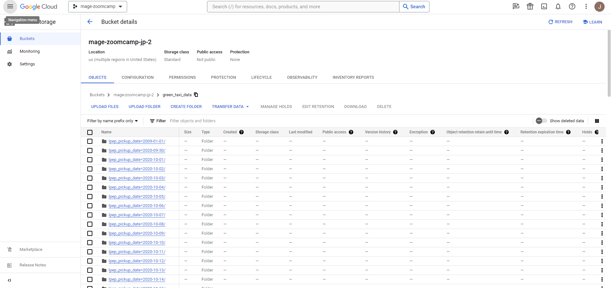
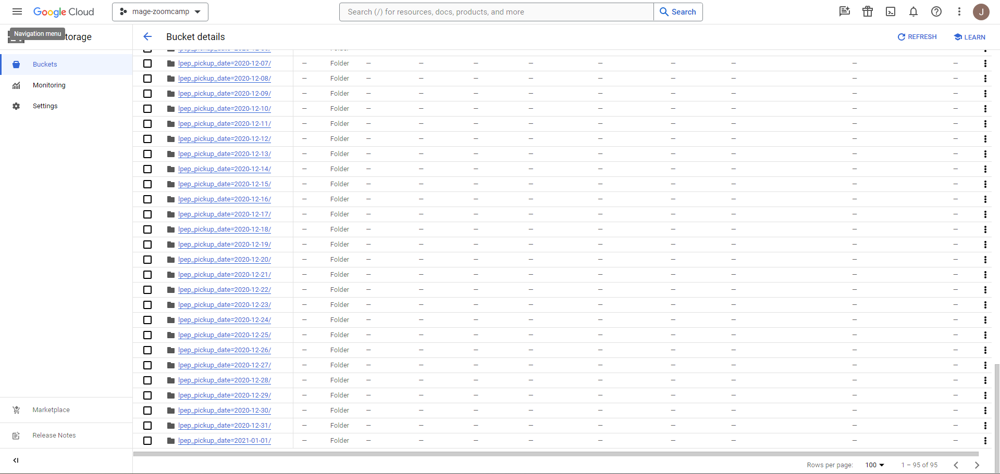

## Homework Week 2 

### Assignment

The goal will be to construct an ETL pipeline that loads the data, performs some transformations, and writes the data to a database (and Google Cloud!).

- Create a new pipeline, call it `green_taxi_etl`
- Add a data loader block and use Pandas to read data for the final quarter of 2020 (months `10`, `11`, `12`).
  - You can use the same datatypes and date parsing methods shown in the course.
  - `BONUS`: load the final three months using a for loop and `pd.concat`
- Add a transformer block and perform the following:
  - Remove rows where the passenger count is equal to 0 _or_ the trip distance is equal to zero.
  - Create a new column `lpep_pickup_date` by converting `lpep_pickup_datetime` to a date.
  - Rename columns in Camel Case to Snake Case, e.g. `VendorID` to `vendor_id`.
  - Add three assertions:
    - `vendor_id` is one of the existing values in the column (currently)
    - `passenger_count` is greater than 0
    - `trip_distance` is greater than 0
- Using a Postgres data exporter (SQL or Python), write the dataset to a table called `green_taxi` in a schema `mage`. Replace the table if it already exists.
- Write your data as Parquet files to a bucket in GCP, partioned by `lpep_pickup_date`. Use the `pyarrow` library!
- Schedule your pipeline to run daily at 5AM UTC.

### Questions

## Question 1. Data Loading

Once the dataset is loaded, what's the shape of the data?

* 266,855 rows x 20 columns ✔
* 544,898 rows x 18 columns
* 544,898 rows x 20 columns
* 133,744 rows x 20 columns

## Question 2. Data Transformation

Upon filtering the dataset where the passenger count is greater than 0 _and_ the trip distance is greater than zero, how many rows are left?

* 544,897 rows
* 266,855 rows
* 139,370 rows ✔
* 266,856 rows

## Question 3. Data Transformation

Which of the following creates a new column `lpep_pickup_date` by converting `lpep_pickup_datetime` to a date?

* `data = data['lpep_pickup_datetime'].date`
* `data('lpep_pickup_date') = data['lpep_pickup_datetime'].date`
* `data['lpep_pickup_date'] = data['lpep_pickup_datetime'].dt.date` ✔
* `data['lpep_pickup_date'] = data['lpep_pickup_datetime'].dt().date()`

## Question 4. Data Transformation

What are the existing values of `VendorID` in the dataset?

* 1, 2, or 3
* 1 or 2 ✔
* 1, 2, 3, 4
* 1

## Question 5. Data Transformation

How many columns need to be renamed to snake case?

* 3
* 6
* 2
* 4 ✔

## Question 6. Data Exporting

Once exported, how many partitions (folders) are present in Google Cloud?

* 96 ✔
* 56
* 67
* 108 
  
# Solution (Green Taxi ETL Pipeline)

## Data Loader
```
import pandas as pd

if 'data_loader' not in globals():
    from mage_ai.data_preparation.decorators import data_loader
if 'test' not in globals():
    from mage_ai.data_preparation.decorators import test


@data_loader
def load_data(*args, **kwargs):
    
    # Link for the Green NY Taxi dataset
    url_10 = "https://github.com/DataTalksClub/nyc-tlc-data/releases/download/green/green_tripdata_2020-10.csv.gz"
    url_11 = "https://github.com/DataTalksClub/nyc-tlc-data/releases/download/green/green_tripdata_2020-11.csv.gz"
    url_12 = "https://github.com/DataTalksClub/nyc-tlc-data/releases/download/green/green_tripdata_2020-12.csv.gz"
    
    urls = [url_10, url_11, url_12]


    taxi_dtypes = {
                    'VendorID': pd.Int64Dtype(),
                    'passenger_count': pd.Int64Dtype(),
                    'trip_distance': float,
                    'RatecodeID':pd.Int64Dtype(),
                    'store_and_fwd_flag':str,
                    'PULocationID':pd.Int64Dtype(),
                    'DOLocationID':pd.Int64Dtype(),
                    'payment_type': pd.Int64Dtype(),
                    'fare_amount': float,
                    'extra':float,
                    'mta_tax':float,
                    'tip_amount':float,
                    'tolls_amount':float,
                    'improvement_surcharge':float,
                    'total_amount':float,
                    'congestion_surcharge':float
                }

    parse_dates = ['lpep_pickup_datetime', 'lpep_dropoff_datetime']

    dfs = []

    for url in urls:
        df = pd.read_csv(url, sep=',', dtype=taxi_dtypes, compression='gzip', parse_dates=parse_dates)
        dfs.append(df)
    
    # Concatenate all DataFrames into a single DataFrame
    result_df = pd.concat(dfs, ignore_index=True)

    return result_df
    


@test
def test_output(output, *args) -> None:
    assert output is not None, 'The output is undefined'
```

## Data Transformer
```
import pandas as pd

if 'transformer' not in globals():
    from mage_ai.data_preparation.decorators import transformer
if 'test' not in globals():
    from mage_ai.data_preparation.decorators import test


@transformer
def transform(data, *args, **kwargs):
    
    # Remove rows where the passenger count is equal to 0 or trip distance equal than 0
    data = data[(data['passenger_count'] > 0) & (data['trip_distance'] > 0)]
    

    # Creates a new column lpep_pickup_date by converting lpep_pickup_datetime to a date.
    data['lpep_pickup_date'] = data['lpep_pickup_datetime'].dt.date

    # Rename columns in Camel Case to Snake Case, e.g. VendorID to vendor_id.
    data.rename(columns = {
        'VendorID':'vendor_id', 
        'RatecodeID':'rate_code_id',
        'PULocationID':'pu_location_id',
        'DOLocationID':'do_location_id'
        }, inplace = True)

    return data

@test
def test_output(output, *args) -> None:
    assert 'vendor_id' in output.columns, "Column 'vendor_id' is not present in the DataFrame."
    assert not (output['passenger_count'].isin([0])).any(), "Column 'passenger_count' contains at least one 0."
    assert not (output['trip_distance'].isin([0])).any(), "Column 'passenger_count' contains at least one 0."
```

## Data Exporter (Postgres Database)
```
from mage_ai.settings.repo import get_repo_path
from mage_ai.io.config import ConfigFileLoader
from mage_ai.io.postgres import Postgres
from pandas import DataFrame
from os import path

if 'data_exporter' not in globals():
    from mage_ai.data_preparation.decorators import data_exporter


@data_exporter
def export_data_to_postgres(df: DataFrame, **kwargs) -> None:
    schema_name = 'mage'  # Specify the name of the schema to export data to
    table_name = 'green_taxi'  # Specify the name of the table to export data to
    config_path = path.join(get_repo_path(), 'io_config.yaml')
    config_profile = 'dev'

    with Postgres.with_config(ConfigFileLoader(config_path, config_profile)) as loader:
        loader.export(
            df,
            schema_name,
            table_name,
            index=False,  # Specifies whether to include index in exported table
            if_exists='replace',  # Specify resolution policy if table name already exists
        )
```

## Data Exporter (Google Cloud Storage)
```
import pyarrow as pa
import pyarrow.parquet as pq 
import os

if 'data_exporter' not in globals():
    from mage_ai.data_preparation.decorators import data_exporter

os.environ['GOOGLE_APPLICATION_CREDENTIALS'] = "/home/src/secret.json"

bucket_name = 'mage-zoomcamp-jp-2'
project_id = 'mage-zoomcamp-413020'

table_name = 'green_taxi_data'

root_path = f"{bucket_name}/{table_name}"

@data_exporter
def export_data(data, *args, **kwargs):
    data['lpep_pickup_date'] = data['lpep_pickup_datetime'].dt.date

    table = pa.Table.from_pandas(data)

    gcs = pa.fs.GcsFileSystem()

    pq.write_to_dataset(
        table,
        root_path=root_path,
        partition_cols=['lpep_pickup_date'],
        filesystem=gcs
    )
```

## Google Cloud Bucket





